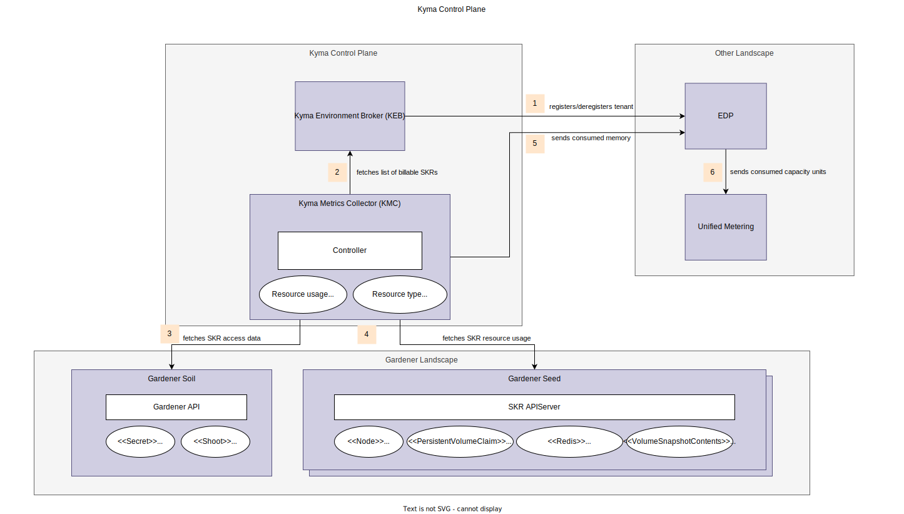

# Contributing to Kyma Metrics Collector

## Overview

To bill hyperscaler resources used by SKR clusters, the Kyma Control Plane (KCP) uses the Kyma Metrics Collector (KMC), which is integrated with Unified Metering using Event Data Platform (EDP).

## Architecture

Every SKR cluster runs in a hyperscaler account dedicated to the related global account, so it is shared between many clusters of the same customer. The hyperscaler account is paid by Kyma, and individual resource usage is charged to the customer. The bill to the end user contains one entry, listing the consumed capacity units (CU) without any further breakdown. The bill is created by the Unified Metering service.



The following step happens once for every SKR registration and deregistration:

1. KEB registers/unregisters a new tenant in EDP.

The following steps happen periodically:

2. KMC workers fetch the list of billable SKR clusters from [Kyma Environment Broker (KEB)](https://github.com/kyma-project/kyma-environment-broker/tree/main) and add them to a queue to work through them. If an error occurs, KMC re-queues the affected SKR cluster. For every process step, internal metrics are exposed with the [Prometheus client library](https://github.com/prometheus/client_golang). For details about the exposed metrics, see the [metrics.md](./metrics.md) file.
3. KMC fetches the kubeconfig for every SKR cluster from the control plane resources.
4. KMC fetches specific Kubernetes resources from the APIServer of every SKR cluster using the related kubeconfig. Hereby, the following resources are collected:
   - node type - using the labeled machine type, KMC maps how much memory and CPU the node provides and maps it to an amount of CPU.
   - storage - for every storage (PersistenceVolumeClaim, VolumeSnapshotContent, and Redis), KMC determines the provisioned GB value.
5. KMC maps the retrieved Kubernetes resources to a memory/CPU/storage value and sends the value to EDP as event stream.
6. EDP calculates the consumed CUs based on the consumed CPU or storage with a fixed formula and sends the consumed CUs to Unified Metering.

## EDP interface

The data sent to EDP must adhere to the schema you see in [prod-schema.json](./assets/prod-schema.json).

See the following example payload:

```json
{
  "timestamp": "2020-03-25T09:16:41+00:00",
  "runtime_id": "52e31334-4819-4f36-9651-8ccd2a29b880",
  "sub_account_id": "52e31334-4819-4f36-9651-8ccd2a29b881",
  "shoot_name": "c-7ea3c81",
  "compute": {
    "vm_types": [
      {
        "name": "Standard_D8_v3",
        "count": 3
      },
      {
        "name": "Standard_D6_v3",
        "count": 2
      }
    ],
    "provisioned_cpus": 24,
    "provisioned_ram_gb": 96,
    "provisioned_volumes": {
      "size_gb_total": 150,
      "count": 3,
      "size_gb_rounded": 192
    }
  },
  "networking": {
    "provisioned_vnets": 2,
    "provisioned_ips": 3
  }
}
```

## KEB Interface

KMC fetches the list of SKR clusters from KEB. KEB provides the list of SKR clusters regardless of their billable state. 
KMC uses this list to populate an internal queue for processing.
Before attempting to add a cluster to the queue, KMC checks if the cluster is billable. If the cluster is not billable, KMC skips the cluster.

### Cluster Lifecycle


### Billing State
