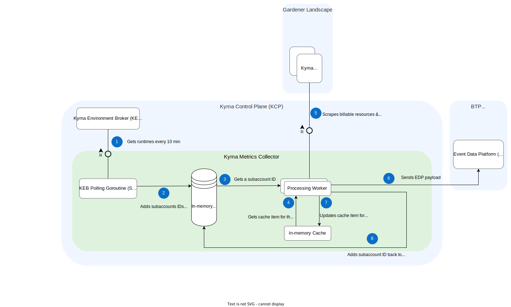

# 1. Architecture for Switching to Unified Metering Backend

Date: 2025-01-15

## Status

Proposed

## Context

Currently, Kyma Metrics Collector (KMC) pushes consumption per runtime every 5 minutes to the Event Data Platform (EDP) backend.
We need to switch to pushing consumption per runtime every 1 hour to the Unified Metering (UM) backend.
Check the wiki page [here](https://wiki.one.int.sap/wiki/display/kyma/Advanced+Customer+Billing#AdvancedCustomerBilling-TargetPicture) for more details.

This is a good point of time to revisit the architecture of KMC and introduce improvements.

## Decision

### Current Architecture With the Event Data Platform (EDP) Backend

#### Data Stored in the In-memory Cache

### New Architecture With the Unified Metering (UM) Backend

#### Data Stored in Cache Directory in the Object Storage Bucket

#### Data Stored in Sending Queue Directory in the Object Storage Bucket

#### Benefits of Having a Persistent Cache and a Persistent Sending Queue

#### Technologies Used

## Consequences
