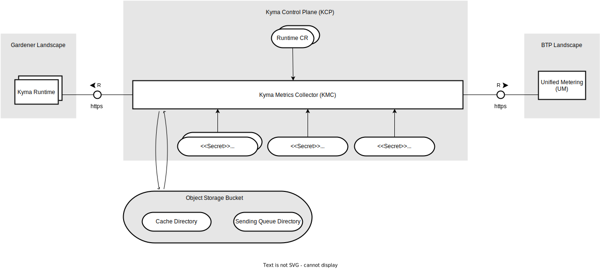

# 2. Architecture for Switching to Unified Metering Backend

Date: 2025-01-15

## Status

Proposed

## Context

Currently, Kyma Metrics Collector (KMC) pushes consumption per runtime every 5 minutes to the Event Data Platform (EDP) backend.
We need to switch to pushing consumption per runtime every 1 hour to the Unified Metering (UM) backend.

For more information, see the [Advanced Customer Billing](https://wiki.one.int.sap/wiki/display/kyma/Advanced+Customer+Billing) Wiki page.

## Decision

### Current Architecture With the Event Data Platform (EDP) Backend


1. `Kym Environment Broker (KEB) Polling Goroutine` sends a request to `KEB` every 10 minutes to get the existing runtimes.
2. `KEB Polling Goroutine` adds the subaccounts' IDs for billable runtimes to the `In-memory Processing Queue`.
3. Each `Processing Worker` gets a subaccount ID from the `In-memory Processing Queue` to start processing it. Note that by default, there are 5 `Processing Workers`.
4. `Processing Worker` gets the cache item for the subaccount ID from the `In-memory Cache`. The cache item contains the last successful scans of the billable resources.
5. `Processing Worker` scrapes billable resources in the runtime and creates an `EDP measurement`. If a scraping fails or the conversion of a scan to an `EDP measurement` fails, then the `Processing Worker` falls back to the scan from the cache.
6. `Processing Worker` sends the payload to EDP.
7. `Processing Worker` updates the cache item for the subaccount ID with the new scan.
8. `Processing Worker` adds the subaccount ID back to the `In-memory Processing Queue` after 5 minutes. This means that `KMC` sends consumption per runtime every 5 minutes to `EDP`.

#### EDP Measurement

The `EDP measurement` has the following `struct`:
```
type EDPMeasurement struct {
	VMTypes            []VMType        
	ProvisionedCPUs    int           
	ProvisionedRAMGb   float64      
	ProvisionedVolumes ProvisionedVolumes
}

type VMType struct {
	Name  string
	Count int
}

type ProvisionedVolumes struct {
	SizeGbTotal   int64
	Count         int
	SizeGbRounded int64
}
```

#### Data Stored in the In-memory Cache

The `In-memory Cache` stores `Records` which have the following `struct`:
```
type Record struct {
	InstanceID      string
	RuntimeID       string
	SubAccountID    string
	GlobalAccountID string
	ShootName       string
	ProviderType    string
	ScanMap         collector.ScanMap
}
```


where the `collector.ScanMap` is a type with the following definition:
```
type ScanMap map[resource.ScannerID]resource.ScanConverter
```
`resource.ScannerID` is a string identifying the scanner (for example `node`, `pvc`, or `redis`), and `resource.ScanConverter` is an interface specifying the method needed for converting a scan to an `EDP measurement`.


The `Scan` structs which implements the `resource.ScanConverter` interface store the entire list of billable resources.
For example, the `PersistentVolumeClaim` and the `VolumeSnapshotContent` scan structs have the following definitions respectively:
```
type Scan struct {
	pvcs corev1.PersistentVolumeClaimList
}
```

```
type Scan struct {
	vscs v1.VolumeSnapshotContentList
}
```

This resulted in high memory consumption and will be improved in the new concept.
 
#### EDP Payload

An example for EDP payload:
```
{
  "timestamp": "2020-03-25T09:16:41+00:00",
  "runtime_id": "52e31334-4819-4f36-9651-8ccd2a29b880",
  "sub_account_id": "52e31334-4819-4f36-9651-8ccd2a29b881",
  "shoot_name": "c-7ea3c81",
  "compute": {
    "vm_types": [
      {
        "name": "Standard_D8_v3",
        "count": 3
      },
      {
        "name": "Standard_D6_v3",
        "count": 2
      }
    ],
    "provisioned_cpus": 24,
    "provisioned_ram_gb": 96,
    "provisioned_volumes": {
      "size_gb_total": 150,
      "count": 3,
      "size_gb_rounded": 192
    }
  },
  "networking": {
    "provisioned_vnets": 2,
    "provisioned_ips": 3
  }
}
```

> **NOTE:** So far, KMC was not sending any data for the "networking" field.
### New Architecture With the Unified Metering (UM) Backend


Flow for each `Runtime Reconciler`:

1. `Runtime Reconciler` reconciles `Runtime CRs` every 20 minutes. Note that in the future, each `Runtime CR` will have a [boolean field](https://github.com/kyma-project/infrastructure-manager/issues/547) indicating whether the runtime is billable or not.
2. `Runtime Reconciler` gets the cache file for the subaccount ID from the `Cache Directory` in the `Object Storage Bucket`. The cache file contains the last successful UM measurements.
3. `Runtime Reconciler` scrapes billable resources in the runtime and creates a `UM measurement`. If scraping fails or the conversion of a scan to an `UM measurement` fails, then the `Runtime Reconciler` falls back to the measurement from the cache.
4. If 1 hour has passed since the last time a `UM measurement` was added to the `Sending Queue` for the subaccount ID, then the `Runtime Reconciler` calculates the Capacity Units and adds the current `UM measurement` to the `Sending Queue`.
> **NOTE:** When an item is added to the `Sending Queue`, a `uuid` is generated. The `uuid` is added to the `In-memory Sending Queue` and the item itself is added to the `Sending Queue Directory` in the `Object Storage Bucket` with the `uuid` as the key.

Flow for each `Sending Worker`:
1. `Sending Worker` gets a `UM measurement` from the `Sending Queue`.
> **NOTE:**  When an item is retrieved from the `Sending Queue`, a `uuid` is retrieved from the `In-memory Sending Queue` and then the item having this `uuid` as the key is retrieved from the `Sending Queue Directory` in the `Object Storage Bucket`.
2. `Sending Worker` sends the payload to UM.
3. If the payload was sent successfully to UM, then the `Sending Worker` removes the `UM measurement` from the `Sending Queue`.
> **NOTE:** When an item is removed from the `Sending Queue`, it means that it will be removed from the `Sending Queue Directory` in the `Object Storage Bucket`.

#### UM Measurement

The `UM measurement` has the following `struct`:

```
type UMMeasurement struct {
	Timestamp                         string
	VMTypes                           []VMType
	ProvisionedCPUs                   int
	ProvisionedRAMGb                  float64
	ProvisionedPersistentVolumeClaims Storage
	ProvisionedVolumeSnapshotContents Storage
	ProvisionedRedis                  []Redis
}

type VMType struct {
	Name  string
	Count int
}

type Storage struct {
	SizeGbTotal   int64
	SizeGbRounded int64
	Count         int
}

type Redis struct {
	Tier        string
	SizeGbTotal int64
	Count       int
}
```

#### Data Stored in Cache Directory in the Object Storage Bucket

The data stored in the `Cache Directory` in the `Object Storage Bucket` can be represented with the following `struct`:

```
type CacheUMMeasurement struct {
	InstanceID             string
	SubAccountID           string
	LastEnqueuingTimestamp string
	MeasurementMap         map[resource.ScannerID]UMMeasurement
}
```

#### Data Stored in Sending Queue Directory in the Object Storage Bucket

The data stored in the `Sending Queue Directory` in the `Object Storage Bucket` can be represented with the following `struct`:

```
type QueueUMMeasurement struct {
	InstanceID      string
	SubAccountID    string
	GlobalAccountID string
	Timestamp       string
	Region          string
	PayloadEntries  []PayloadEntry
}

type PayloadEntry struct {
	ID               string
	Measure          Measure
	CustomDimensions map[string]string
}

type Measure struct {
	ID    string
	Value int64
}
```

#### UM Payload

For more information on the UM payload schema, see the [documentation](https://pages.github.tools.sap/metering/documentation/docs/unified-metering/meter-your-app/#32-record-usage-for-btp-customer-managed-datastream).
An example for UM payload for one runtime:

```
[
   {
      "id": "a2214e4e-9629-42a0-8fbb-5d204c29c21d",
      "timestamp": "2022-11-14T09:30:00.339Z",
      "consumer": {
         "region": "cf-eu10",
          "btp": {
            "environment": "KUBERNETES",
            "globalAccount": "dacce822-b68b-4cb8-9600-2ad630a10a17",
            "subAccount": "96ce4d05-c1a3-46ae-aa9d-e6d0b07e0e6d",
            "instance": "d6004172-fbc2-4e3c-b696-306a0ac62448"
          }
      },
      "product": {
         "service": {
            "id": "xfs-kyma",
            "plan": "standard"
         }
      },
      "measure": {
         "id": "capacity_units",
         "value": 1
      }
   },
   {
      "id": "b2214e4e-9629-42a0-8fbb-5d204c29c21d",
      "timestamp": "2022-11-14T09:30:00.339Z",
      "consumer": {
         "region": "cf-eu10",
          "btp": {
            "environment": "KUBERNETES",
            "globalAccount": "dacce822-b68b-4cb8-9600-2ad630a10a17",
            "subAccount": "96ce4d05-c1a3-46ae-aa9d-e6d0b07e0e6d",
            "instance": "d6004172-fbc2-4e3c-b696-306a0ac62448"
          }
      },
      "product": {
         "service": {
            "id": "xfs-kyma",
            "plan": "standard"
         }
      },
      "measure": {
         "id": "vm_type",
         "value": "Standard_D8_v3"
      },
      "customDimensions": {
         "count": 3
      }
   },
   {
      "id": "c2214e4e-9629-42a0-8fbb-5d204c29c21d",
      "timestamp": "2022-11-14T09:30:00.339Z",
      "consumer": {
         "region": "cf-eu10",
          "btp": {
            "environment": "KUBERNETES",
            "globalAccount": "dacce822-b68b-4cb8-9600-2ad630a10a17",
            "subAccount": "96ce4d05-c1a3-46ae-aa9d-e6d0b07e0e6d",
            "instance": "d6004172-fbc2-4e3c-b696-306a0ac62448"
          }
      },
      "product": {
         "service": {
            "id": "xfs-kyma",
            "plan": "standard"
         }
      },
      "measure": {
         "id": "cpus",
         "value": 24
      }
   },
   {
      "id": "d2214e4e-9629-42a0-8fbb-5d204c29c21d",
      "timestamp": "2022-11-14T09:30:00.339Z",
      "consumer": {
         "region": "cf-eu10",
          "btp": {
            "environment": "KUBERNETES",
            "globalAccount": "dacce822-b68b-4cb8-9600-2ad630a10a17",
            "subAccount": "96ce4d05-c1a3-46ae-aa9d-e6d0b07e0e6d",
            "instance": "d6004172-fbc2-4e3c-b696-306a0ac62448"
          }
      },
      "product": {
         "service": {
            "id": "xfs-kyma",
            "plan": "standard"
         }
      },
      "measure": {
         "id": "ram_gb",
         "value": 96
      }
   },
   {
      "id": "e2214e4e-9629-42a0-8fbb-5d204c29c21d",
      "timestamp": "2022-11-14T09:30:00.339Z",
      "consumer": {
         "region": "cf-eu10",
          "btp": {
            "environment": "KUBERNETES",
            "globalAccount": "dacce822-b68b-4cb8-9600-2ad630a10a17",
            "subAccount": "96ce4d05-c1a3-46ae-aa9d-e6d0b07e0e6d",
            "instance": "d6004172-fbc2-4e3c-b696-306a0ac62448"
          }
      },
      "product": {
         "service": {
            "id": "xfs-kyma",
            "plan": "standard"
         }
      },
      "measure": {
         "id": "persistent_volume_claims_size_gb_total",
         "value": 150
      },
      "customDimensions": {
         "count": 3,
         "size_gb_rounded": 192,
      }
   },
   {
      "id": "f2214e4e-9629-42a0-8fbb-5d204c29c21d",
      "timestamp": "2022-11-14T09:30:00.339Z",
      "consumer": {
         "region": "cf-eu10",
          "btp": {
            "environment": "KUBERNETES",
            "globalAccount": "dacce822-b68b-4cb8-9600-2ad630a10a17",
            "subAccount": "96ce4d05-c1a3-46ae-aa9d-e6d0b07e0e6d",
            "instance": "d6004172-fbc2-4e3c-b696-306a0ac62448"
          }
      },
      "product": {
         "service": {
            "id": "xfs-kyma",
            "plan": "standard"
         }
      },
      "measure": {
         "id": "volume_snapshot_contents_size_gb_total",
         "value": 150
      },
      "customDimensions": {
         "count": 3,
         "size_gb_rounded": 192,
      }
   },
   {
      "id": "g2214e4e-9629-42a0-8fbb-5d204c29c21d",
      "timestamp": "2022-11-14T09:30:00.339Z",
      "consumer": {
         "region": "cf-eu10",
          "btp": {
            "environment": "KUBERNETES",
            "globalAccount": "dacce822-b68b-4cb8-9600-2ad630a10a17",
            "subAccount": "96ce4d05-c1a3-46ae-aa9d-e6d0b07e0e6d",
            "instance": "d6004172-fbc2-4e3c-b696-306a0ac62448"
          }
      },
      "product": {
         "service": {
            "id": "xfs-kyma",
            "plan": "standard"
         }
      },
      "measure": {
         "id": "redis_tier",
         "value": "S1"
      },
      "customDimensions": {
         "count": 3,
         "size_gb_total": 150,
      }
   }
]
```

#### Benefits of Having a Persistent Cache and a Persistent Sending Queue

A persistent cache ensures that cached data is not lost when KMC restarts.
KMC may restart for various reasons, such as upgrades or crashes due to exceeding memory limits.

Similarly, a persistent sending queue prevents the loss of `UM measurements` if KMC is temporarily unable to send them to UM.
This could happen due to network issues or if the UM service is down. During this time, the `Runtime Reconciler` continues scraping resources and adding `UM measurements` to the Sending Queue.
Once the network connection is restored or the UM service becomes available again, the `Sending Workers` resume sending `UM measurements` to UM.

#### Technologies Used

* [minio-go](https://github.com/minio/minio-go) will be used as the client SDK for the object storage.
The main benefit of mini-go is that it will work with any object storage as long as it is S3 compatible.

* [workqueue](https://pkg.go.dev/k8s.io/client-go/util/workqueue) package will be used for the `In-memory Sending Queue`.
The main benefit of this workqueue is that it supports multiple consumers and this is needed for our use case since multiple 
`Sending Workers` will be concurrently getting items from the `In-memory Sending Queue`.

#### Threat Modeling



For more information on the threat modeling for the new architecture, see the [documentation](https://wiki.one.int.sap/wiki/pages/viewpage.action?pageId=5007037549).
